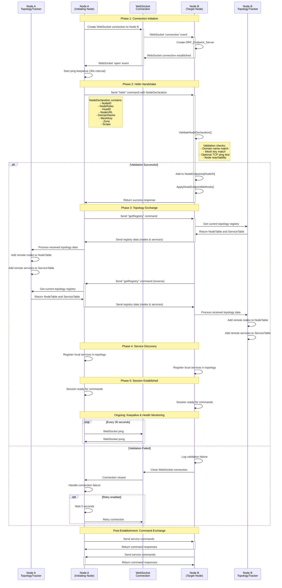

# DRP Node Session Initiation Process

This document describes the complete sequence of events when two DRP (Declarative Resource Protocol) nodes establish a session connection in the Node.js implementation.

## Overview

The DRP mesh enables distributed services to discover and communicate with each other through a secure, authenticated node-to-node session establishment process. This process involves WebSocket connection establishment, authentication, topology exchange, and service discovery.

## Components Involved

- **DRP_Node** (`node.js`) - Main node class containing session logic
- **DRP_NodeClient** (`client.js`) - Handles outbound connections to other nodes
- **DRP_Endpoint** (`endpoint.js`) - Manages connection endpoints
- **DRP_RouteHandler** (`routehandler.js`) - Processes incoming WebSocket connections
- **DRP_TopologyTracker** (`topologytracker.js`) - Manages mesh topology information
- **DRP_WebServer** (`webserver.js`) - Provides listening interface for incoming connections

## Session Initiation Sequence

The following Mermaid diagram illustrates the complete node-to-node session establishment process:



## Authentication and Security

### Security Features

- **Domain Isolation**: Nodes are segmented by domain and optionally by zone
- **mTLS Authentication** (preferred): mTLS certs used for mesh participation
- **Mesh Key Authentication** (lab): Shared secret used for mesh participation
- **Network Reachability**: Optional TCP ping validation to prevent unreachable nodes
- **Connection Limits**: Configurable limits on concurrent connections
- **Encryption**: WebSocket connections can use TLS (WSS)

### Endpoint Authentication - mTLS

If the client endpoint is configured with a valid mTLS cert, the **hello** step will be bypassed.

### Endpoint Authentication - Domain and Mesh Key

If the client endpoint is configured to use a static domain and mesh key, a **hello** will be sent containing these parameters.  The server endpoint will authenticate the client with this logic.

```javascript
async ValidateNodeDeclaration(declaration) {
    // Check domain match
    let domainsMatch = (!thisNode.DomainName && !declaration.DomainName || 
                      thisNode.DomainName === declaration.DomainName);
    
    // Check mesh key match
    let meshKeysMatch = (!thisNode.#MeshKey && !declaration.MeshKey || 
                        thisNode.#MeshKey === declaration.MeshKey);
    
    // Optional: TCP ping verification if RejectUnreachable is set
    if (declaration.NodeURL && thisNode.RejectUnreachable) {
        let pingInfo = await tcpPing({ address, port, timeout: 500, attempts: 2 });
        if (!pingInfo.avg) return false;
    }
    
    return domainsMatch && meshKeysMatch;
}
```

## Node Declaration Structure

The node declaration exchanged during the hello handshake contains:

```javascript
{
    NodeID: "hostname-12345",           // Unique node identifier
    NodeRoles: ["Provider", "Consumer"], // Node capabilities
    HostID: "server01",                 // Physical host identifier
    NodeURL: "ws://node.example.com:8080", // Listening URL
    DomainName: "production",           // Security domain
    MeshKey: "secret-mesh-key",         // Authentication key
    Zone: "us-east-1",                  // Geographic or logical zone (should another be added to distinguish between the two?)
    Scope: "global"                     // Service scope
}
```

## Topology Exchange

After successful authentication, nodes exchange their complete topology information:

### Registry Data Structure
```javascript
{
    NodeTable: {
        "nodeID": {
            NodeID: "nodeID",
            Roles: ["Provider"],
            Zone: "us-east-1",
            // ... other node properties
        }
    },
    ServiceTable: {
        "serviceInstanceID": {
            Name: "MyService",
            Type: "Database",
            Zone: "us-east-1",
            NodeID: "nodeID",
            // ... other service properties
        }
    }
}
```

## Error Handling and Recovery

### Endpoint Connection Failure Scenarios

1. **Authentication Failure**: Invalid domain or mesh key
   - Connection immediately closed
   - Error logged with reason
   - No retry attempted

2. **Network Failure**: Connection timeout or loss
   - Automatic retry with exponential backoff
   - Configurable retry attempts and intervals
   - Graceful degradation

3. **Protocol Error**: Invalid message format
   - Connection closed with error code
   - Detailed error logging
   - Optional blacklisting of problematic nodes

### Endpoint Connection Retry Logic

```javascript
async CloseHandler(closeCode) {
    if (this.retryOnClose) {
        let retryDelay = Math.min(5000 * Math.pow(2, this.retryAttempts), 60000);
        await thisEndpoint.DRPNode.Sleep(retryDelay);
        this.RetryConnection();
    }
}
```

## Performance Considerations

- **Connection Pooling**: Reuse of established connections for multiple service calls
- **Topology Awareness**: Nodes keep track of both local and remote services via routing advertisements
- **Compression**: Optional WebSocket message compression for large payloads
- **Multiplexing**: Single connection handles multiple concurrent service requests
- **Keepalive**: Efficient ping/pong mechanism to detect connection health

## Monitoring and Observability

### Connection Metrics
- Connection establishment time
- Authentication success/failure rates
- Topology sync duration
- Active connection count
- Message throughput

### Health Checks
- WebSocket ping/pong response times
- Service availability checks
- Network reachability tests
- Memory and CPU usage monitoring

## Configuration Options

### Node Configuration
```javascript
{
    HostID: "server01",
    DomainName: "production",
    MeshKey: "secret-key",
    Zone: "us-east-1",
    RejectUnreachable: true,
    MaxConnections: 100,
    PingInterval: 30000,
    RetryOnClose: true,
    MaxRetryAttempts: 5
}
```

This session initiation process ensures secure, authenticated, and topology-aware connections between DRP nodes, enabling distributed service discovery and communication across the mesh network.
