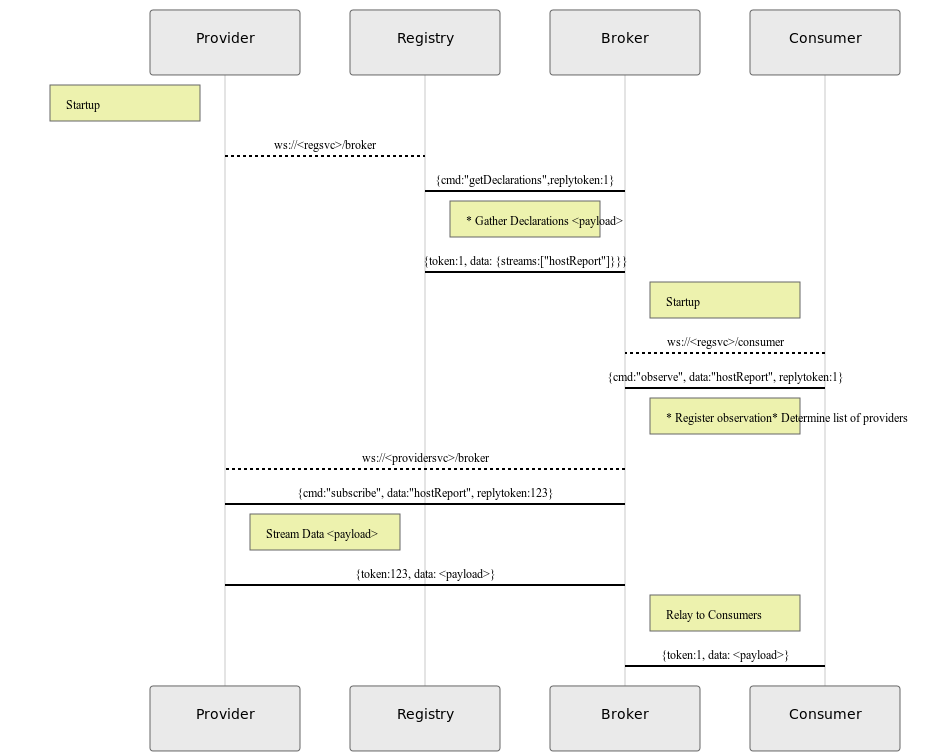

# DRP
Declarative Resource Protocol - a stateful, JSON based protocol for declaring and consuming resources.

# Overview
In legacy applications, resource dependencies are often statically defined.  When a new service component is
introduced, DNS, load balancer entries, firewall rules, monitoring, etc must be provisioned.  DRP can reduce
complexity by providing a mechanism for allowing service providers to self-register and dynamically routing
resource requests.

# Goals
Reduce barriers between resources and consumers
Minimize infrastructure component requirements
Reduce complexity involved in implementing HA

# Components
Registries - Track and distribute state of providers and their resources
Providers - Declare services, objects and streams available for consumption
Brokers - Process resource requests and track declarations from consumers
Consumers - Client facing applications, monitoring and analytics

