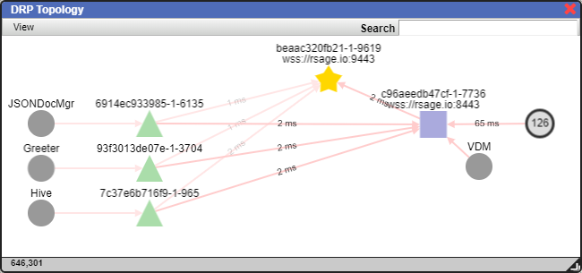

## DRP
Declarative Resource Protocol - a JSON based Websocket subprotocol for declaring and consuming resources.

## Overview
In legacy applications, resource dependencies are often statically defined.  When a new service component is
introduced, DNS, load balancer entries, firewall rules, monitoring, etc must be provisioned.  DRP can reduce
complexity by providing a mechanism for allowing service providers to self-register and dynamically routing
resource requests.

## Goals
* Reduce barriers between resources and consumers
* Minimize infrastructure component requirements
* Reduce complexity involved in implementing HA
* Provide mechanism for resource discovery and structure traversal

## Components
**Registries** - Track and distribute state of providers and their resources<br>
**Providers** - Declare services, objects and streams available for consumption<br>
**Brokers** - Process resource requests and track declarations from consumers<br>
**Consumers** - Client facing applications, monitoring and analytics<br>

## Demo
The public demo is hosted at https://rsage.io:8443.  To run it on your own system, either grab the Docker container or clone this repo.


**Option 1: Docker Container**
```
docker pull adhdtech/drp-nodejs
docker create --name drp-demo -p 8080:8080 -e "PORT=8080" -e "HOSTNAME=localhost" adhdtech/drp-nodejs
docker start drp-demo
```

**Option 2: Git Clone**
```
git clone https://github.com/adhdtech/DRP.git DRP
```

Checkout repo, change to directory.  Execute the following to start a demo service which provides the Registry, Provider and Broker routes on ws://localhost:8080
```
cd DRP-nodejs
npm install
node server.js
```

## Web UI
Running server.js will also start the rSage web interface on http://localhost:8080 which connects to the Broker on ws://localhost:8080.

## DRP Topology Viewer
In the rSage web interface on http://localhost:8080, Click Go -> DRP Topology to see a map of all nodes currently connected to the mesh.  The direction as well as current latency and uptime for each connection is displayed.

Here is a sample from the public demo site.



## Command Testing
Click Go -> Command Testing to see the commands exposed to DRP Consumers.<br>
* **getCmds** - List DRP Consumer commands<br>
* **getRegistry** - Get dump of Registry<br>
* **listServiceInstances** - List Services and which Providers offer them<br>
* ... more ....


## PowerShell PSDrive
Navigate the DRP topology via CLI using the DRPDrive.dll module.  Open a PowerShell session and run the following.
```
cd PSDrive\bin\Debug
Import-Module .\DRPDrive.dll
Connect-DRP -Alias local -URL ws://localhost:8080
dir drp:\local

# Dump the Mesh registry
gi drp:\local\Mesh\Registry

# List Services available in Mesh
dir drp:\local\Mesh\Services

# Execute a service command
gi drp:\local\Mesh\Services\JSONDocMgr\ClientCmds\listFiles

# List Streams available in Mesh
dir drp:\local\Mesh\Streams

# Retrieve last 10 messages sent to a stream
gi drp:\local\Mesh\Streams\RESTLogs\{nodeID}\LastTen

# View list of attached Nodes & Consumers
dir drp:\local\Endpoints\Nodes
dir drp:\local\Endpoints\Consumers

# Dump the Mesh Topology
gi drp:\local\NodeObj\RouteHandler\EndpointCmds\getTopology

# Retrieve HTML document from a consumer web session for debugging
gi drp:\local\Endpoints\Consumers\{consumerID}\HTMLDocument\children\0\outerHTML

# Execute a command on the consumer web session to RickRoll the user
gi drp:\local\Endpoints\Consumers\{consumerID}\RickRoll
```

## Sample Providers
This starts a sample Provider which listens on ws://localhost:8081 and connects to the Registry at ws://localhost:8080
```
node drpProvider-Test.js
```
This starts a sample Provider which does not listen for connections; it connects directly to Brokers who need it
```
node drpProvider-Test-NoListener.js
```

Let's take a look at the relevant code.  In these samples we're creating a simple test service and advertising it to the mesh.


Now let's test the new service

Client|Output
---|---
Web UI|
REST|
PowerShell|


## Sample Consumer
This sample will start a Consumer which connects to the Broker on ws://localhost:8080 and subscribes to the dummy stream
```
node drpConsumer.js
```

## Stream Subscription


## Stream Subscription (Provider behind firewall or not listening)

